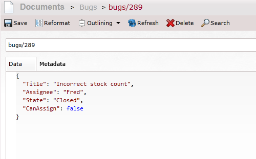

RavenDB Workflow Sample using Stateless
=========================================

Requirements
-------------------

- Visual Studio 2012
- Nuget (Package Restore)

Hints
-------------------------------

I've created a sample that uses Stateless (Nuget: Stateless) as the workflow engine, and RavenDB as the persistence store. There are some choices you have to make to get the state machine saved to RavenDB and rehydrated properly.

1. You have to have the default constructor redefine the state machine states along with the transitions. This is because the Serialization process will wipe away the definition of your state machine.

2. Ignore your state machine and trigger properties. As stated above, they don't serialize properly anyways and will give you no value in the database.

3. Make your enums for States and Triggers public, so they serialize nicely.

4. Have Fun!

What it looks like when serialized in the database:

Notes
----------------------

The sample I am using is directly from the Stateless code base, but modified to work with RavenDB. I am also thinking about using the state machine as a shell for calls to a message queue, like RabbitMQ. This will let you distribute your state machines across your infrastructure. You should need to be careful about timing your saves and messages properly.

Questions
-------------------------

1. Should you let the state machine handle saving itself, or should it be wrapped inside of a unit of work?
2. How frequently should you save the state machine? After each event? 
3. How to handle invalid state? (Stateless throws an exception if you try to transition incorrectly).

License
----------------------

The MIT License (MIT)
Copyright (c) 2013 Khalid Abuhakmeh

Permission is hereby granted, free of charge, to any person obtaining a copy of this software and associated documentation files (the "Software"), to deal in the Software without restriction, including without limitation the rights to use, copy, modify, merge, publish, distribute, sublicense, and/or sell copies of the Software, and to permit persons to whom the Software is furnished to do so, subject to the following conditions:

The above copyright notice and this permission notice shall be included in all copies or substantial portions of the Software.

THE SOFTWARE IS PROVIDED "AS IS", WITHOUT WARRANTY OF ANY KIND, EXPRESS OR IMPLIED, INCLUDING BUT NOT LIMITED TO THE WARRANTIES OF MERCHANTABILITY, FITNESS FOR A PARTICULAR PURPOSE AND NONINFRINGEMENT. IN NO EVENT SHALL THE AUTHORS OR COPYRIGHT HOLDERS BE LIABLE FOR ANY CLAIM, DAMAGES OR OTHER LIABILITY, WHETHER IN AN ACTION OF CONTRACT, TORT OR OTHERWISE, ARISING FROM, OUT OF OR IN CONNECTION WITH THE SOFTWARE OR THE USE OR OTHER DEALINGS IN THE SOFTWARE.